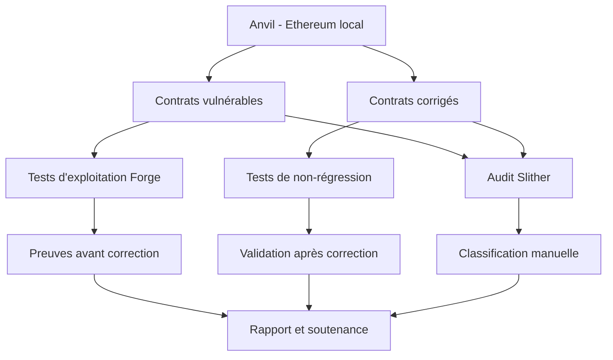

# Architecture EtherShield

```mermaid
flowchart TD
 A[Anvil - Ethereum local] --> B[Contrats vulnérables]
 A --> C[Contrats corrigés]
 B --> D[Tests d'exploitation Forge]
 C --> E[Tests de non-régression]
 B --> F[Audit Slither]
 C --> F
 D --> G[Preuves avant correction]
 E --> H[Validation après correction]
 F --> I[Classification manuelle]
 G --> J[Rapport et soutenance]
 H --> J
 I --> J
```
Principes : environnement isolé, scénarios reproductibles, comparaison avant/après et analyse statique complétée par revue manuelle.
